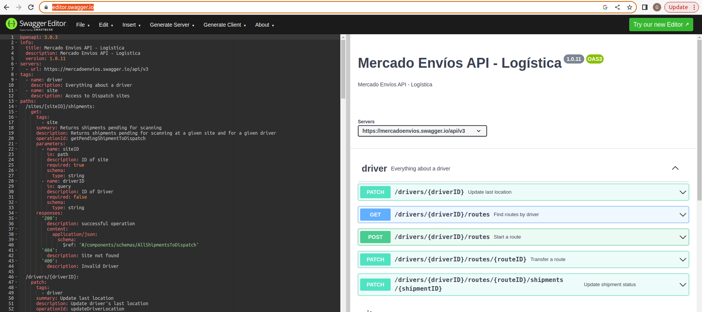

# <u>Ejercicio 1</u>
### Enunciado:

Queremos que nos ayudes a diseñar un sistema para integrar nuestra red logística con las aplicaciones de celular de los drivers que operan la misma.
Todos los días, estos drivers, se acercan a distintos puntos y mediante su celular escanean los QR de los paquetes, que son productos que deben entregar. Estos paquetes ya fueron pre-seleccionados, es decir, deben escanear el 100% de los paquetes que se les ofrecen. (alrededor de 80 paquetes en promedio por conductor)
Una vez escaneados todos los paquetes, tocan el botón "comenzar ruta", informando al sistema que paquetes se han llevado. Esto transiciona el estado de cada paquete y da inicio a la ruta trackeando cada evento. A su vez, se emite un informe por mail que sirve de auditoría y se envía a los clientes un aviso a sus celulares de que el paquete está en camino y estará llegando en el día.

### Su tarea consiste en:

1.  Diseñar los endpoints que crea conveniente para ejecutar la operatoria entre el
celular y nuestro sistema. Determinar verbo http, cuerpo y URL. (omitir todo
llamado interno del sistema)

#### Respuesta:
   - Colocar en esta url [Swagger IO](https://editor.swagger.io/) el contenido de este archivo [yaml](./openapi/openapi.yaml)

2. Armar un diseño que muestre las relaciones del sistema para cumplir el requerimiento. Debe tener en cuenta la funcionalidad, resiliencia y todo lo que crea conveniente para hacer un sistema lo más robusto posible teniendo en cuenta que se espera alta demanda (gran cantidad de RPM) en un sistema muy crítico para el negocio. El gráfico es orientativo no necesita cumplir normas de UML, ni ningún formalismo, pero debe intentar dejar claro, relaciones, e infraestructura básica destacable.
   
    
    Notas:

   - Tiene total libertad de diseño, no existe un diseño perfecto. Tenga en cuenta dejar en claro decisiones, modelar las entidades que necesite o crea conveniente y todo lo que robustezca al sistema.
   - Lo ya dibujado en los gráficos son aplicaciones que ya existen, utilícelas como caja negra de tecnología perfecta. En particular el sistema de notificaciones no hace falta que informe el destino de los mensajes, simplemente marque el uso de este, el sistema entregará las notificaciones como corresponde.
   - El JSON de la app mobile es una idea de los datos que tiene el celular al momento de iniciar la ruta, es decir, quien está logueado y que se escaneó hasta el momento. Use esos datos como desee, en el formato que desee y agregue o quite la información que crea conveniente para diseñar los endpoints

