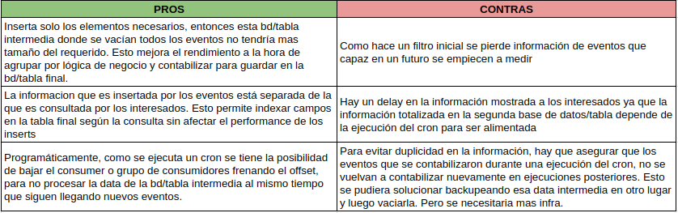
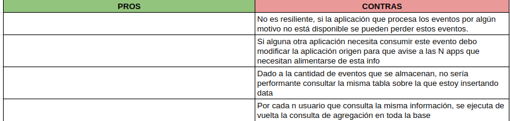
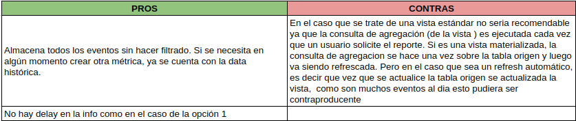
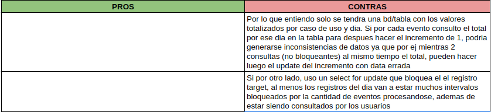

# <u>Ejercicio 2</u>
### Enunciado:

El equipo se encuentra debatiendo opciones de diseño y ud. debe inclinarse por alguna de las propuestas que están sobre la mesa justificando el por qué de la decisión, indicando pros y contras de la opción seleccionada. Es un plus a la respuesta que determine pros y sobre todo contras de las opciones descartadas. La idea es obtener un producto resiliente y escalable en alta demanda.
Nos encontramos diseñando métricas según eventos (varios millones de ellos en el  día), es decir, contamos una lógica de negocio según su ocurrencia. Por ej, la cantidad de rutas creadas, cantidad de paquetes entregados, cantidad de paquetes despachados, cantidad de drivers que trabajaron, etc.

###  OPCIÓN SELECCIONADA:  1

---
### OPCIÓN 1

Recibir en una aplicación mediante un tópico de un servicio de cola los eventos de forma individual, detectar si aplican a una lógica de negocio y si eso ocurre hacer un insert del mismo en una base de datos con las información del evento recibido, luego en un segundo proceso croneado leer esos eventos generados y contabilizarlos y disponer el total según la medición en una nueva base de datos distinta de la primera. Esa segunda base es consultada directamente por los interesados e indexada por los campos de búsqueda más habituales.
   

---
### OPCIÓN 2

Recibir cada evento directamente de las aplicaciones que generan el mismo, haciendo que solo se comuniquen los eventos que queremos medir. Dejamos los mismos en una base de datos. Cuando el interesado consulta hacemos una query de agregación para obtener el total, tenemos índices por los campos de consulta  habituales.

---
### OPCIÓN 3

Recibir en una aplicación mediante un tópico de un servicio de cola los eventos de forma individual, almacenar todos los eventos en una base de datos. Allí y gracias a una serie de índices, hacer las querys que se necesiten para obtener el total por caso de uso, incluso llegando a armar vistas para que el cliente consulte.

---
### OPCIÓN 4

Recibir en una aplicación mediante un tópico de un servicio de cola los eventos de forma individual, detectar a que caso de uso corresponde contabilizar y upgradear los datos del día de dicha métrica con los datos ya totalizados. Esos datos se disponibilizan al cliente con la ayuda de índices por los campos más buscados.

