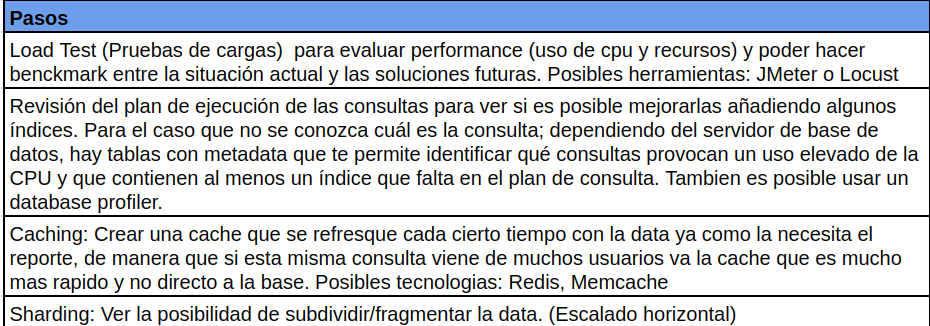

# <u>Ejercicio 3</u>
### Enunciado:

Actualmente contamos con una aplicación web que muestra el detalle de todas las rutas de entrega de productos que hacen todos nuestros almacenes. De momento se alimenta esta pantalla haciendo una serie de querys en la única base de datos que tiene todos los registros de rutas, paquetes, drivers, y estados de todos ellos, se agrupan por rutas y se totaliza la información como en el siguiente ejemplo:

Lamentablemente la pantalla para dar toda la información de todas las rutas está tardando mucho y estresa demasiado a la base de datos y es evidente que ya no puede escalar.

Haciendo todas las suposiciones que crea convenientes y haciendo un simple check de mejoras habituales. Nombre al menos 3 técnicas, tecnologías o mejoras que haría para que una página llena de información como en la imagen pueda escalar y entregue más velocidad de respuesta sin riesgo a quedar fuera de servicio.

### Respuesta:

